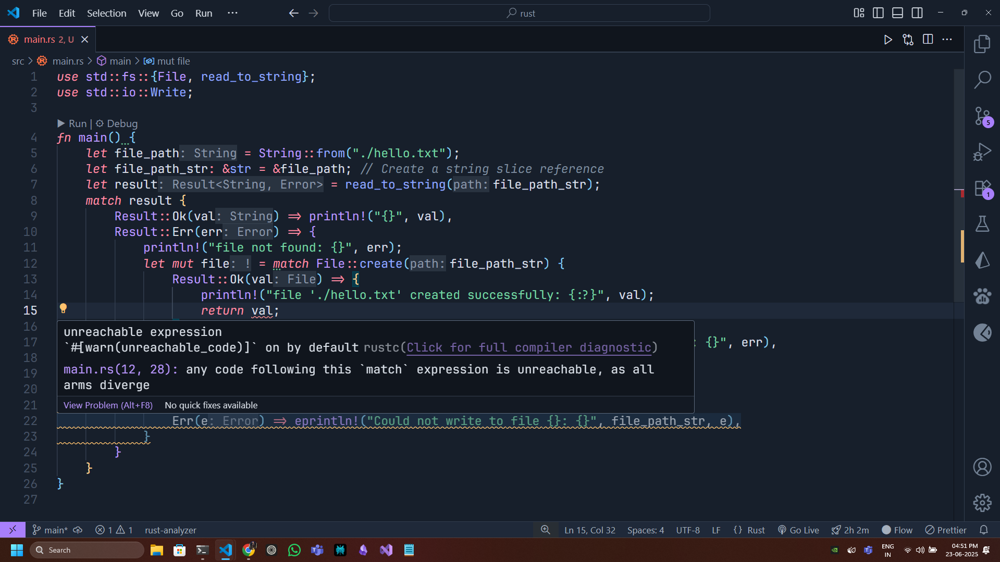

# Return and tail block expressions

In Rust, nearly everything is an expression—and expressions evaluate to values. That includes `{ … }` blocks, `if`/`else`, `match`, and even loops (when they `break` with a value). But there’s a critical distinction between:

1. **A tail expression** (the last expression in a block, _without_ a semicolon), which makes the block itself evaluate to that value.
2. The **`return` statement**, which immediately exits the _entire_ function (or `->`-declared closure), yielding its value to the caller.

They look similar—both give you a value `x`—but they behave very differently. Let’s dig in.

---

## 1. Tail expressions: implicit block return

```rust
fn foo() -> i32 {
    let a = 1;
    let b = 2;
    // The block below is the whole function body. Its last expression is `a + b`,
    // so the function value is 1 + 2 = 3.
    {
        a + b      // ← **no** semicolon → this is a *tail expression*
    }
}
```

- **No semicolon** → makes it a _pure_ expression.
- The block `{ a + b }` _evaluates_ to `3`, and because it’s the _last thing_ in `foo`, `foo()` returns `3`.
- You don’t write `return a + b;`. Rust lets you omit `return` for the last expression.

### Why no semicolon?

```rust
let x = {
    10;     // with semicolon, this becomes a statement, yields `()`
};
assert_eq!(x, ()); // `x` is the unit value, not 10
```

- Adding a trailing semicolon turns an expression into a statement.
- Statements don’t produce useful values; they produce `()`.
- Thus, if you want a block to “be” a value, its last line **must not** end in `;`.

---

## 2. The `return` keyword: early exit

```rust
fn bar(x: i32) -> i32 {
    if x < 0 {
        return -1;     // immediately exit *bar*, returning -1
    }
    x * 2               // tail expression for the “normal” path
}
```

- `return -1;` here bails out of `bar` completely, even if there were more code below.
- Any code after a `return` is unreachable (and the compiler will warn you).
- You can `return` from _anywhere_ in the function, not just at the end.

---

## 3. Key differences

| Feature          | Tail Expression                     | `return` Statement          |
| ---------------- | ----------------------------------- | --------------------------- |
| **Scope**        | Value of the _current block_        | Exits the _entire function_ |
| **Syntax**       | Last line, **no** semicolon         | Always `return <expr>;`     |
| **Control flow** | Continues through function normally | Unconditionally jumps out   |
| **Use cases**    | Final result of a computation       | Early exits, error handling |

---

## 4. Why not just always use `return`?

Rust’s design encourages an _expression-oriented_ style:

- It’s more concise when the main logic naturally flows to a final result.
- You avoid “deep nesting” of `if`/`else` with early `return`s.
- Writers can still use `return` when they want to bail out early (e.g., input validation, error cases).

### Example: nested logic with and without `return`

**With tail expressions:**

```rust
fn compute(x: i32) -> i32 {
    if x < 0 {
        -1   // the `if` is an expression, so the whole function returns -1
    } else {
        let y = x * 2;
        y + 10   // tail expression
    }
}
```

**Mixing in early return:**

```rust
fn compute(x: i32) -> i32 {
    if x < 0 {
        return -1;   // clear early-exit for invalid case
    }
    let y = x * 2;
    y + 10          // final result
}
```

Both are idiomatic; the choice depends on which reads clearer for your logic.

## A very good example

```rust
use std::fs::{File, read_to_string};
use std::io::Write;

fn main() {
    let file_path = String::from("./hello.txt");
    let file_path_str: &str = &file_path; // Create a string slice reference
    let result = read_to_string(file_path_str);
    match result {
        Result::Ok(val) => println!("{}", val),
        Result::Err(err) => {
            println!("file not found: {}", err);
            let mut file = match File::create(file_path_str) {
                Result::Ok(val) => {
                    println!("file './hello.txt' created successfully: {:?}", val);
                    val // notice how I have not used return here, so that if the 'Ok' value matches the variable file has the file value(of type File) in it hence making the file.write_all() method to be called upon in the match expression below, if you do NOT return anything here the compiler will complain that .write_all() doesn't exist on the file variable
                }
                Result::Err(err) => panic!("Error creating the file './hello.txt': {}", err),
            };

            match file.write_all(b"Hello, Rust!\nThis is a new file.") {
                Ok(_) => println!("Successfully wrote to {}", file_path_str),
                Err(e) => eprintln!("Could not write to file {}: {}", file_path_str, e),
            }
        }
    }
}

```

```rust
use std::fs::{File, read_to_string};
use std::io::Write;

fn main() {
    let file_path = String::from("./hello.txt");
    let file_path_str: &str = &file_path; // Create a string slice reference
    let result = read_to_string(file_path_str);
    match result {
        Result::Ok(val) => println!("{}", val),
        Result::Err(err) => {
            println!("file not found: {}", err);
            let mut file = match File::create(file_path_str) {
                Result::Ok(val) => {
                    println!("file './hello.txt' created successfully: {:?}", val);
                    return val; // here it'll make the below `match` expression unreachable because this will exit out of the main function scope itself, and we need the file value to execute the match statement below hence we use the above concept of tail block expressions instead of literally returning the value
                }
                Result::Err(err) => panic!("Error creating the file './hello.txt': {}", err),
            };

            match file.write_all(b"Hello, Rust!\nThis is a new file.") {
                Ok(_) => println!("Successfully wrote to {}", file_path_str),
                Err(e) => eprintln!("Could not write to file {}: {}", file_path_str, e),
            }
        }
    }
}

```



---

## 5. Under the hood: types and the diverging `!`

- Every expression in Rust has a type, even a block:

  - A block with a tail expression `E` has the _type_ of `E`.
  - A block ending with a semicolon has type `()` (unit).

- The `return` statement has the _diverging_ type `!` (pronounced “never”)—it never produces a normal value in that spot because control leaves the function.
- Rust’s type system and compiler enforce that a function’s body must either:

  - End in a tail expression whose type matches the function’s return type, or
  - Unconditionally `return` or `panic!` (also diverges with `!`) on all paths.

---

## 6. Summary

- **Tail expression** (no semicolon) → value of the block → implicitly returned if at the end of a function.
- **`return expr;`** → jumps out of the current function right away, giving `expr` to the caller.

They’re not interchangeable:

- Writing `return x;` inside a block _exits the function_ (making the rest unreachable).
- Writing `x` as the last line of a block just makes that block _evaluate_ to `x` and continues executing at the function level.

Understanding this distinction helps you leverage Rust’s expression-oriented style for clear, concise code, while still having an escape hatch (`return`) for early exits or error handling.
